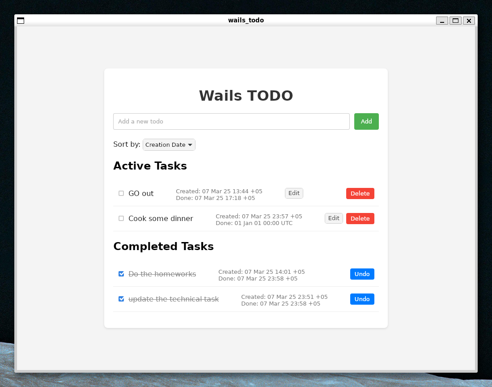
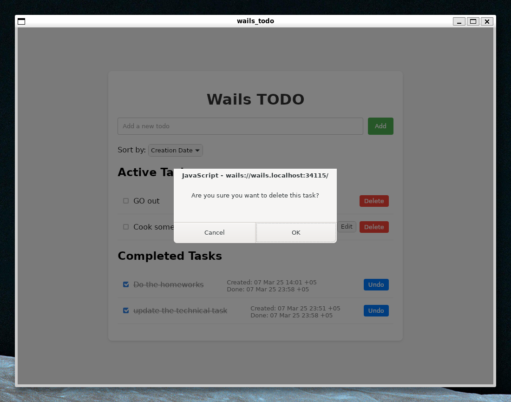

# Wails ToDo List Приложение

## О проекте
Todo приложение, построенное с помощью Wails, объединяющее backend на Go с frontend на React.

## Технологический стек

### Backend (Go)
- **Wails**: Фреймворк для создания desktop приложений с использованием Go и веб-технологий
- **База данных**: Локальное хранение в JSON файле с правильной обработкой ошибок
- **UUID**: Для генерации уникальных идентификаторов задач
- **Управление временем**: Форматирование времени RFC822 для согласованной обработки дат

### Frontend (React + Vite)
- **React**: UI библиотека для создания компонентных интерфейсов
- **shadcn/ui**: Выбран за:
  - Красиво разработанные компоненты
  - Доступность из коробки
  - Удобное копирование компонентов
  - Поддержка светлой/темной темы

### Почему shadcn/ui + Vite + pnpm?

#### Преимущества shadcn/ui
1. **Настройка компонентов**: Прямой доступ к исходному коду компонентов
2. **Нет внешних зависимостей**: Компоненты являются частью вашей кодовой базы
4. **Доступность**: ARIA-совместимые компоненты
5. **Современный дизайн**: Следование текущим трендам UI/UX

#### Преимущества Vite
1. **Быстрая разработка**: Молниеносная замена модулей
2. **Современные инструменты сборки**: Построен на основе esbuild
3. **Поддержка React**: Первоклассная поддержка React
4. **Малый размер бандла**: Эффективное разделение кода

#### Преимущества pnpm
1. **Эффективность дискового пространства**: Экономит место с помощью адресуемого по содержимому хранилища
2. **Быстрая установка**: Параллельное разрешение пакетов
3. **Строгость**: Предотвращает фантомные зависимости
4. **Поддержка монорепозиториев**: Встроенная поддержка рабочих пространств
5. **Безопасность**: Улучшенная безопасность с символическими ссылками

## Checklist

- [x] 1. Интерфейс пользователя
  - [x] Основная часть (15 баллов)
    - [x] Создать интерфейс с текстовым полем для ввода новой задачи.
    - [x] Добавить кнопку для добавления задачи в список.
    - [x] Отображать список всех задач на экране.
  - [x] Бонусная часть (10 баллов)
    - [x] Использовать CSS для стилизации интерфейса.
    - [x] Использовать значки или цвета для обозначения выполненных и невыполненных задач.
- [x] 2. Добавление задач
  - [x] Основная часть (10 баллов)
    - [x] Реализовать функционал для добавления новой задачи в список.
    - [x] Валидация ввода (проверка на пустой ввод).
    - [x] Удаление задачи
  - [x] Бонусная часть (10 баллов)
    - [x] Позволить пользователю добавлять задачи с датой и временем выполнения.
- [x] 3. Удаление задач
  - [x] Основная часть (5 баллов)
    - [x] Реализовать возможность удаления задач из списка.
  - [x] Бонусная часть (10 баллов)
    - [x] Добавить подтверждение удаления задачи (модальное окно).
- [x] 4. Изменение статуса задач (to do -> done)
  - [x] Основная часть (10 баллов)
    - [x] Реализовать возможность отметки задачи как выполненной.
    - [x] Зачеркивание текста выполненных задач.
  - [x] Бонусная часть (10 баллов)
    - [x] Перемещение выполненных задач в отдельный раздел "Выполненные задачи".
    - [x] Позволить пользователю отменять отметку выполнения задачи.
- [x] 5. Сохранение состояния
  - [x] Основная часть (20 баллов)
    - [x] Сохранение состояния задач в локальное хранилище (например, в файл) при закрытии приложения.
    - [x] Загрузка состояния задач при запуске приложения.

## Скриншоты

### Главный экран


### Создание задачи


### Удаление задач



## Установка

### Предварительные требования
- Go 1.18 или новее
- Node.js 14 или новее
- pnpm 6 или новее

### Настройка среды разработки

1. Установка pnpm:
```bash
curl -fsSL https://get.pnpm.io/install.sh | sh -
```

2. Установка shadcn/ui -> Vite:
```bash
pnpm create vite@latest
```

3. Установка зависимостей:
#### Installation of MongoDB

```
docker run --name some-mongodb -p 27017:27017 mongo
```

#### Go
```
go mod tidy

go get go.mongodb.org/mongo-driver/mongo
go get go.mongodb.org/mongo-driver/bson
```

#### Mongo Golang quickstart

```

```


#### pnpm dependencies
```bash
pnpm install
```

## Структура проекта

```
wails_todo/
├── app.go              # Backend код на Go
├── frontend/          
│   ├── src/
│   │   ├── App.jsx    # Главный React компонент
│   │   └── index.css  # CSS
│   └── package.json   
├── todos.json         # Локальное хранилище
└── wails.json        # Конфигурация Wails
```

## Разработка

### Живая разработка
```bash
wails dev
```

### Сборка для продакшена
```bash
wails build
```

## Возможности

- Операции создания, чтения, обновления, удаления (CRUD) для задач
- Постоянное хранение в локальном JSON файле
- Обновления в реальном времени
- Адаптивный дизайн
- Доступные компоненты
- Поддержка темной/светлой темы
- Обработка ошибок и состояний загрузки

## Участие в разработке

1. Форкните репозиторий
2. Создайте ветку для функционала
3. Зафиксируйте изменения
4. Отправьте в ветку
5. Создайте Pull Request